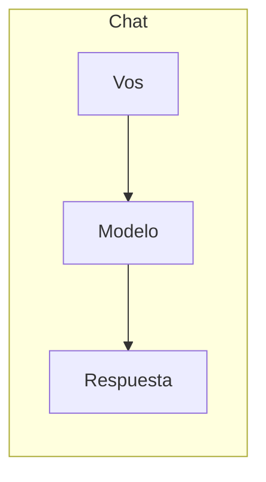
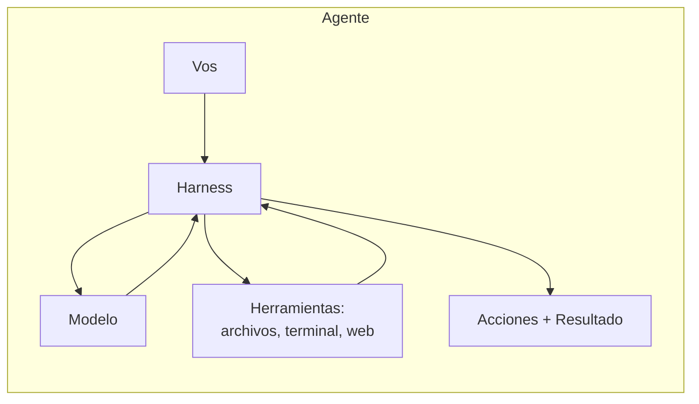
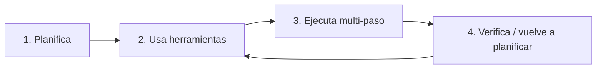
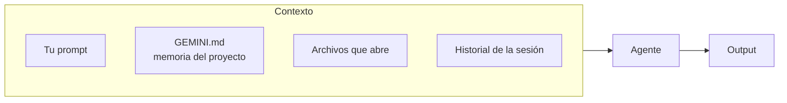
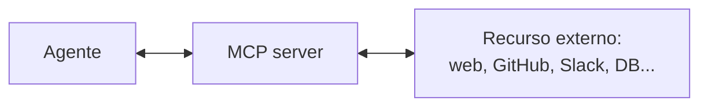

<script src="./mermaid.min.js"></script>
<script>
  mermaid.initialize({ startOnLoad: true, theme: 'default', securityLevel: 'loose' });
</script>

<!-- _class: lead -->

# Agentic AI en la práctica

### Una intro corta y opinada para becarios Chevening

<br>

<span class="small">Franco Galeano · Mayo 2026 · Inspirado en MY580 (LSE)</span>

---

## Disclaimer

- Hay **cientos** de herramientas, opiniones, y "mejores prácticas" en este espacio.
- **Todo cambia rápido.** Parte de lo que diga hoy va a estar desactualizado en 6 meses.
- **No hay una forma correcta.** Cualquiera que les diga lo contrario les está vendiendo algo.

<br>

El objetivo de hoy: **que se vayan capaces de empezar**, no enseñarles la receta perfecta.

---

## Agenda (2 horas)

1. **Charla intro + Q&A** — qué es agentic AI, qué cuidados tener (~35 min).
2. **Demo en vivo** — sobre un proyecto real de alguien acá (~10 min).
3. **Hands-on** — cada uno arranca su template, con apoyo en sala (~75 min).

<br>

Materiales: <span class="small">github.com/tartagalensis/taller-agenticAI-chevening</span>

---

<!-- _class: lead -->

# Parte 1
## ¿Qué es "agentic AI"?

---

## Chat ≠ Agente





El **harness** es lo que convierte un modelo (chat) en un agente: le da memoria, herramientas, y la capacidad de ejecutar pasos.

---

## Lo que hace un agente



- Lee y escribe archivos en tu disco.
- Corre comandos en la terminal.
- Usa el resultado para decidir el próximo paso.
- Repite hasta terminar (o bloquearse).

---

## ¿Por qué les importaría a ustedes?

**Donde los agentes brillan:**

- **Análisis de datos** — leer un CSV, escribir el script, correrlo, devolver resultados con gráficos. Sin saber Python ni R.
- **Programar sin saber programar** — el agente itera contra el compilador, vos describís qué querés. Funciona porque hay un *feedback loop real*.
- **Proyectos end-to-end** — el agente trabaja en tus archivos, mantiene contexto entre pasos, ejecuta comandos. Sin copy-paste de un chat.

**También se usan para — con asterisco:**

- Resumir, agrupar, comparar documentos.
- ⚠️ Los LLMs **no son tan buenos en esto** como parece. Alucinan, dicen lo que querés oír, omiten matices. Verificá siempre.

<br>

**No** es para reemplazarles el pensamiento. Es para acelerar las primeras 2-3 iteraciones.

---

<!-- _class: lead -->

# Parte 2
## Contexto es todo

---

## El agente solo "sabe" lo que está en el contexto



- Lo que **no esté en el contexto, no existe** para el agente.
- Su "memoria" entre sesiones la cargás vos, en archivos.
- Mientras más relevante y compacto, mejor responde.

---

## `GEMINI.md` — memoria persistente

Un archivo en la raíz del proyecto que el agente lee al inicio de cada sesión:

```markdown
## What this project is
Sintetizar 3 papers sobre transferencias condicionadas
para mi tesis.

## How to work with me
- Plan before acting.
- Don't invent facts.
- Output goes to `output/`.
- Sources in `docs/` are read-only.
```

Convención: 3-4 secciones, **frases cortas**, reglas explícitas. Si tu proyecto crece, el archivo crece con él.

---

## Higiene de sesión

| Hacé | No hagas |
|---|---|
| Planificar antes de actuar | Pedirle "hacé todo" en un prompt gigante |
| Scope chico, iteraciones cortas | Sesiones de 3 hs sin pausa |
| Verificar lo que escribió | Aceptar el output sin leerlo |
| Decirle qué *no* hacer | Asumir que va a hacer lo razonable |

<br>

Regla de oro: **si no leíste el output, no lo terminaste.**

---

<!-- _class: lead -->

# Parte 3
## Nada es lo que parece

---

## Sycophancy + confidently wrong

- Los modelos están entrenados a sonar útiles y seguros.
- Eso los lleva a:
  - Decir "tenés razón" cuando no la tenés.
  - Inventar citas, números, autores que suenan creíbles.
  - Sostener una respuesta incorrecta cuando los confrontás.

<br>

**Verificá.** Especialmente: números, citas, nombres propios, fechas. Si suena demasiado bien, probablemente es alucinación.

---

## Deuda técnica y cognitiva

**Deuda técnica:** el agente puede producir código/documentos que funcionan pero son frágiles, inconsistentes, o difíciles de mantener. *Si no entendés lo que generó, no podés debuggearlo.*

**Deuda cognitiva:** si delegás todo el pensamiento, no aprendés. *Investigación delegada a un agente no es tu investigación.*

<br>

Usalo para **acelerarte** en las partes mecánicas. Mantené tu cerebro encendido en las decisiones.

---

<!-- _class: lead -->

# Parte 4
## Demo en vivo

<br>

<span class="small">Sobre un proyecto real de alguien en la sala.</span>

---

<!-- _class: lead -->

# Parte 5
## Manos a la obra

---

## Lo que vas a hacer ahora (~75 min con apoyo)

1. Abrí `project_template/` en VSCode.
2. Copialo y renombralo con tu proyecto:
   ```bash
   cp -r project_template mi-proyecto
   cd mi-proyecto
   ```
3. Editá `GEMINI.md` — completá las dos frases (qué hacés, qué querés producir).
4. Abrí terminal integrada, corré `gemini`, y mandá tu primer prompt.

<br>

No hace falta terminar nada hoy. **Solo arrancar.**

---

## ¿Qué viene después?

Dos cosas para tener en el radar — no las van a usar hoy, pero saber que existen les abre el siguiente nivel:

- **Skills** → recetas reusables que el agente invoca cuando aplican.
- **MCP** → conectar al agente con herramientas externas (filesystem, web, GitHub, Slack...).

<br>

Las próximas slides son un sobrevuelo. Cero apuro por dominar esto hoy.

---

<!-- _class: lead -->

# Skills

### Recetas reusables que el agente invoca solo

---

## ¿Qué es una skill?

Un archivo (`SKILL.md`) con instrucciones claras de **qué hace**, **cuándo usarla**, y **cómo proceder**. Vive en una carpeta de tu proyecto (o globalmente) y el agente la lee cuando aplica.

```markdown
---
name: memo-reviewer
description: Use when the user has a draft policy memo and wants
  structured feedback before sending it.
---

# Memo reviewer

## When to use
- Draft of memo, briefing, op-ed
- User asks for "feedback" or "critique"

## How to proceed
1. Read the draft fully.
2. Score 6 categories (clarity, evidence, structure...).
3. Save critique to `output/<filename>-critique.md`.
```

---

## ¿Cuándo conviene crear una?

Cuando hacés la **misma tarea con el mismo método más de 3 veces**: revisar memos, estructurar notas, comparar drafts, generar minutas.

**Sin skill** → cada vez le repetís en el prompt cómo querés que lo haga.
**Con skill** → el cómo está versionado en archivo, el agente decide solo cuándo aplicarla.

<br>

Documentación oficial:
- Claude Code: [docs.claude.com/en/docs/claude-code/skills](https://docs.claude.com/en/docs/claude-code/skills)
- Ejemplos: [De Kadt's project_demo/.claude/skills/](https://github.com/ddekadt/MY580_agentic_ai/tree/main/project_demo/.claude/skills)

---

<!-- _class: lead -->

# MCP
### Model Context Protocol

### El agente sale de tu carpeta hacia el mundo

---

## ¿Qué problema resuelve?

Tu agente, por defecto, **solo ve tu proyecto**. MCP es un protocolo abierto que estandariza cómo conectarlo con cosas de afuera: tu filesystem completo, búsqueda web, GitHub, Slack, bases de datos, calendarios.



**La clave:** un mismo server MCP sirve para cualquier cliente compatible (Gemini CLI, Claude Code, Cursor...). Es como USB para agentes.

---

## ¿Cuándo conviene?

- Necesitás **info actualizada** que el agente no tiene → server de web search.
- Querés que **lea papers de otra carpeta** sin moverlos → server de filesystem con scope explícito.
- Trabajás en equipo y querés que **lea issues de GitHub o mensajes de Slack** → servers específicos.

<br>

⚠️ **Cuidado con la seguridad.** Cada server suma superficie de acceso. Empezá con scope chico, evaluá qué le estás dando.

Lista completa: [github.com/modelcontextprotocol/servers](https://github.com/modelcontextprotocol/servers)

---

## Lo que me gustaría que se lleven

- **El agente es una herramienta**, no un colega. La responsabilidad sigue siendo tuya.
- **Contexto > prompt fancy.** Un `GEMINI.md` bien hecho rinde más que mil "actúa como experto".
- **Plan first, verify always.** Pedile que piense antes de actuar; lee lo que escribió.
- **El ecosistema cambia rápido.** Lo que importa son los patrones, no los productos.

---

## Créditos y referencias

Inspirado conceptualmente en:

**MY580 — Agentic AI for Social Science and Data Science Research**
Daniel de Kadt · London School of Economics
[github.com/ddekadt/MY580_agentic_ai](https://github.com/ddekadt/MY580_agentic_ai)

<br>

Las metáforas, el framing, y muchos de los ejemplos provienen de ese workshop. Materiales acá son propios (sin reuso de assets).

---

<!-- _class: lead -->

# Gracias

<br>

Issues y dudas: en el repo del taller.
